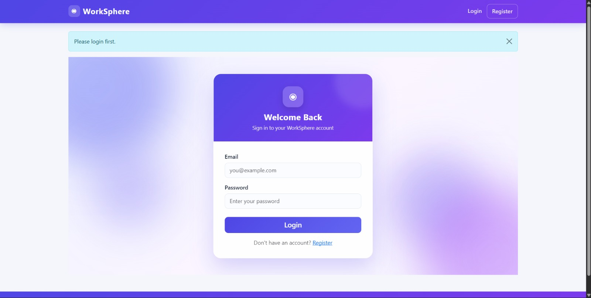
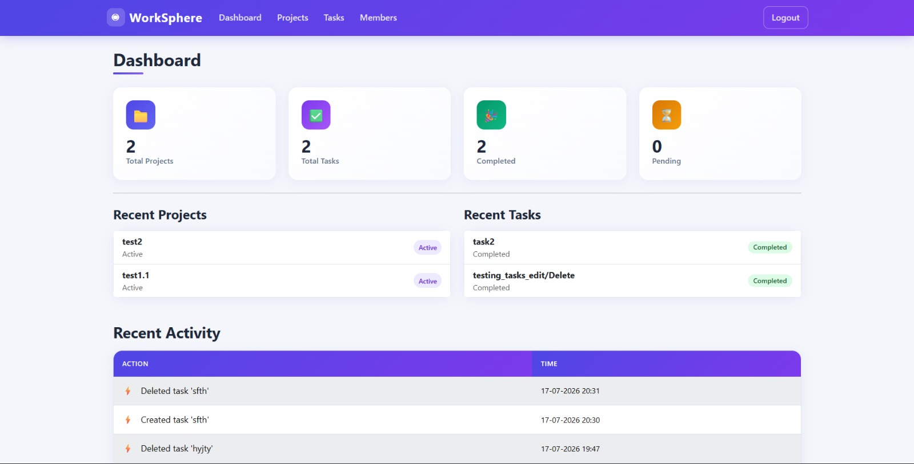
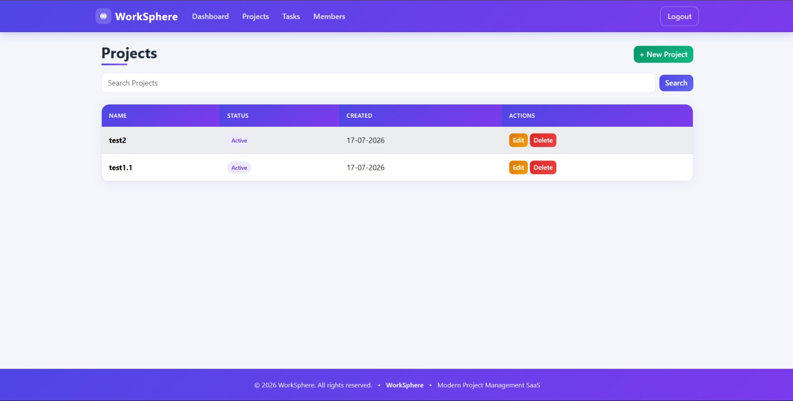
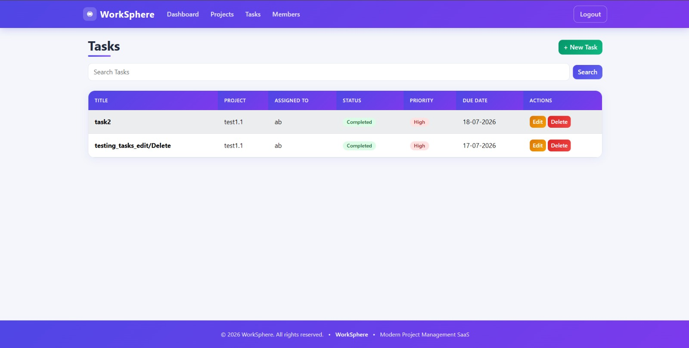
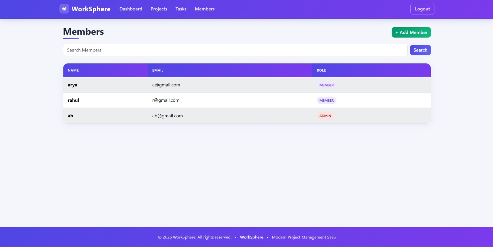
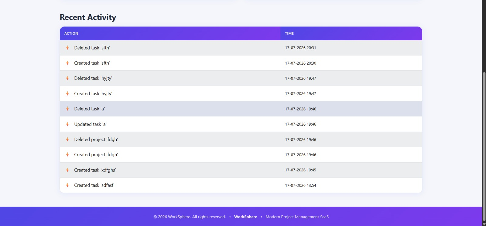

# 🚀 WorkSphere

A multi-tenant SaaS Project & Task Management System built with **Flask**, **PostgreSQL**, and **JWT Authentication**. WorkSphere enables organizations to manage projects, tasks, and team members securely with Role-Based Access Control (RBAC).

---

## 📌 Features
# 📸 Screenshots

## 📸 Login



---

## 📊 Dashboard



---

## 📁 Projects



---

## ✅ Tasks



---

## 👥 Members



---

## 📝 Activity Logs



---


## ☁️ Deployment


### 🔐 Authentication
- Organization Registration
- Secure Login using JWT
- Password Hashing
- Session Management

### 🏢 Multi-Tenant Architecture
- Multiple organizations supported
- Complete data isolation between organizations
- Separate users, projects, tasks, and activity logs for each organization

### 👥 User & Role Management
- Admin
- Member
- Role-Based Access Control (RBAC)
- Member Management

### 📁 Project Management
- Create Project
- View Projects
- Edit Project
- Delete Project
- Search Projects

### ✅ Task Management
- Create Tasks
- Assign Tasks
- Edit Tasks
- Delete Tasks
- Due Dates
- Priority Levels
- Task Status
- Search Tasks

### 📊 Dashboard
- Total Projects
- Total Tasks
- Completed Tasks
- Pending Tasks
- Recent Projects
- Recent Tasks
- Recent Activity Logs

### 📝 Activity Logs
Tracks important actions including:
- Project Creation
- Project Update
- Project Deletion
- Task Creation
- Task Update
- Task Deletion
- Member Creation

### 🔍 Search
- Search Projects
- Search Tasks
- Search Members

### ⚠ Error Handling
- Custom 403 Page
- Custom 404 Page
- Custom 500 Page

---

# 🛠 Tech Stack

## Backend
- Python
- Flask
- Flask SQLAlchemy
- Flask JWT Extended
- Flask Migrate
- Flask WTF

## Database
- PostgreSQL

## Frontend
- HTML5
- CSS3
- Bootstrap 5
- Jinja2

## Deployment
- Render

---

# 📂 Project Structure

```
WorkSphere
│
├── app
│   ├── auth
│   ├── dashboard
│   ├── projects
│   ├── tasks
│   ├── members
│   ├── activity
│   ├── models
│   ├── templates
│   ├── static
│   ├── utils
│   ├── extensions.py
│   ├── config.py
│   └── __init__.py
│
├── migrations
├── uploads
├── instance
├── run.py
├── requirements.txt
└── README.md
```

---

# 🗄 Database Schema

### Organizations
- id
- name
- email
- slug
- created_at

### Users
- id
- organization_id
- name
- email
- password_hash
- role
- created_at

### Projects
- id
- organization_id
- created_by
- name
- description
- status
- created_at

### Tasks
- id
- project_id
- assigned_to
- title
- description
- priority
- status
- due_date
- created_at

### Activity Logs
- id
- organization_id
- user_id
- action
- created_at

---

# ⚙ Installation

Clone the repository

```bash
git clone <repository-url>
```

Move into the project

```bash
cd worksphere
```

Create a virtual environment

```bash
python -m venv venv
```

Activate virtual environment

### Windows

```bash
venv\Scripts\activate
```

### Linux / macOS

```bash
source venv/bin/activate
```

Install dependencies

```bash
pip install -r requirements.txt
```

Configure the `.env` file

```env
SECRET_KEY=your_secret_key
JWT_SECRET_KEY=your_jwt_secret
DATABASE_URL=your_postgresql_database_url

UPLOAD_FOLDER=uploads
MAX_CONTENT_LENGTH=16777216
DEBUG=True
```

Run migrations

```bash
flask db upgrade
```

Start the application

```bash
python run.py
```

---

# 🔐 Roles

## Admin
- Manage Members
- Create Projects
- Edit Projects
- Delete Projects
- Create Tasks
- Edit Tasks
- Delete Tasks
- View Dashboard
- View Activity Logs

## Member
- Login
- View Dashboard
- View Projects
- View Tasks

---

# 🌐 Deployment

The application is deployed using **Render** with a **PostgreSQL** database.

---

# 🔒 Security Features

- JWT Authentication
- Password Hashing
- Role-Based Access Control
- Multi-Tenant Data Isolation
- CSRF Protection
- Environment Variable Configuration

---


# 👨‍💻 Author

**Harshit Gautam**

---

# 📄 License

This project is developed for educational purposes.